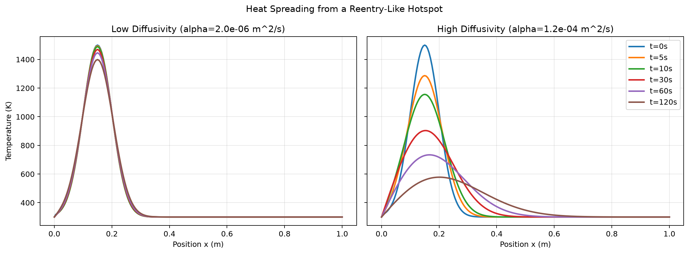
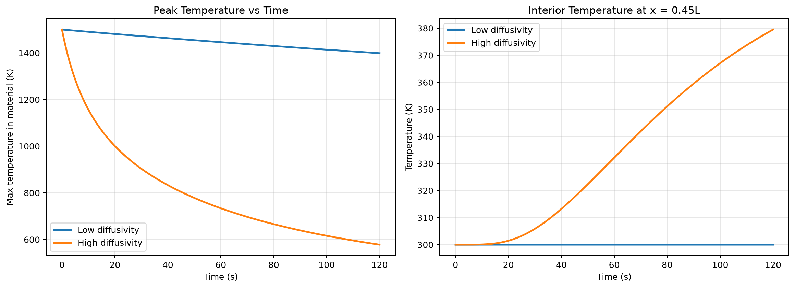

# Heat Transfer Modeling in Spacecraft Materials

A numerical simulation project using the **1D heat equation** to study how thermal diffusivity changes the way heat moves through a material. The project begins with a general heat-conduction model and then applies the same numerical framework to a reentry-inspired spacecraft thermal-protection problem.

Developed as part of **MATH 440: Mathematical Modeling** at Christopher Newport University.



## Mathematical Model

The simulation solves

$$
\frac{\partial T}{\partial t}=\alpha\frac{\partial^2 T}{\partial x^2},
$$

where $T(x,t)$ is temperature and $\alpha$ is thermal diffusivity.

The PDE is approximated with an **explicit finite-difference method** on a one-dimensional spatial grid. The time step is selected to satisfy the explicit-scheme stability condition

$$
r=\frac{\alpha\Delta t}{\Delta x^2}\leq 0.5.
$$

## What the Project Investigates

The notebook explores two related questions:

- How does an initial temperature distribution diffuse through a 1D material over time?
- How does changing thermal diffusivity affect peak temperature, heat spreading, and the temperature experienced deeper inside a spacecraft wall?

The reentry-inspired model compares an illustrative **low-diffusivity material** with a **higher-diffusivity, RCC-like case**. Rather than treating one material as universally better, the analysis highlights the engineering tradeoff: high diffusivity can spread a localized hot spot and reduce steep thermal gradients, while low diffusivity can slow the transport of heat toward the protected interior.



## Numerical Workflow

- Define the spatial grid, thermal diffusivity, and boundary conditions
- Select a stable time step for the explicit finite-difference scheme
- Step the heat equation forward in time
- Record temperature profiles at selected times
- Compare low- and high-diffusivity cases
- Track peak temperature and interior/probe temperature over time
- Interpret the results as a thermal-protection design tradeoff

## Repository Contents

- `heat_transfer_modeling.ipynb` — complete numerical model and analysis, with notebook outputs cleaned for easier review
- `figures/` — generated visualizations of the thermal simulations
- `requirements.txt` — Python dependencies

## Tools and Methods

**Python · NumPy · Matplotlib · Partial Differential Equations · Finite Differences · Numerical Simulation**

The project demonstrates PDE discretization, numerical stability analysis, boundary-condition implementation, parameter comparison, and visualization of a time-dependent physical system.

## Running the Project

```bash
pip install -r requirements.txt
jupyter notebook heat_transfer_modeling.ipynb
```

## Why I Built It

I enjoy using mathematics to understand why physical systems behave the way they do. This project gave me a way to connect differential equations and numerical methods with an engineering problem where material properties and design assumptions produce directly observable changes in system behavior. That model-to-simulation-to-interpretation workflow is one I hope to extend to biomedical engineering problems involving biomechanics, devices, materials, and physiological systems.
